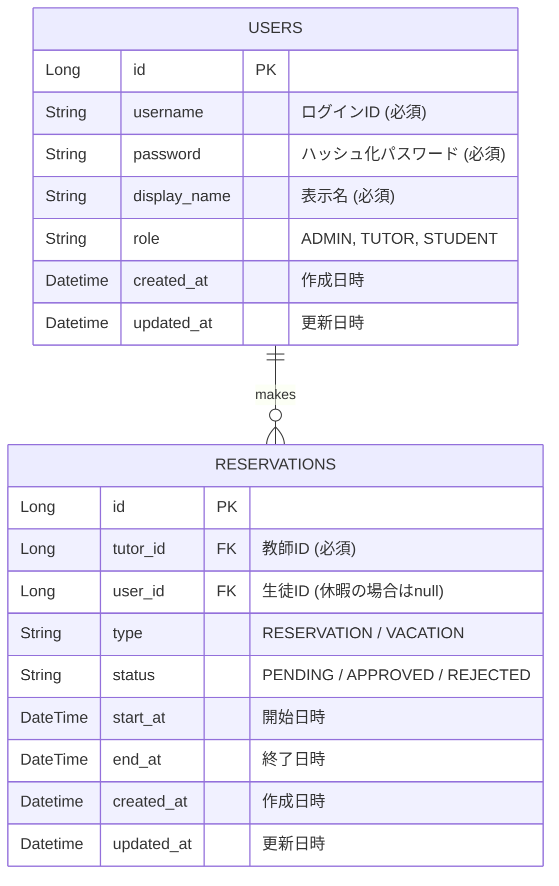

# 要件定義書：ken-reserve (けんぼう家庭教師予約システム)

## 1. プロジェクト概要

* **システム名:** ken-reserve
* **目的:**
  * LINEベースの予約調整を自動化し、講師の空き時間をWeb公開・予約可能にする。
  * Java 21 / Spring Boot 4.x 系を用いたプログラミング学習と実用化。
* **コンセプト:** 最小限の画面数で、最速で立ち上げる（MVP開発）。
* **ターゲット:** 家庭教師（講師）、生徒、保護者。

## 2. ユーザーロール

| ロール | 説明 |
| --- | --- |
| **管理者** | ユーザーの作成・管理、システム全体の監視。 |
| **講師** | スケジュールの登録（休暇設定）、予約の承認・キャンセル操作。 |
| **生徒/保護者** | 空き枠の確認、予約申請、自身の予約キャンセル。 |

## 3. 業務ロジック・制約ルール

AIが実装を誤らないよう、カレンダーのロジックを厳密に定義します。

* **時間枠 (Slot):** 09:00 〜 21:00 の間、30分刻みで表示。
* **授業定義:** 1授業 **60分固定**。
* **バッファルール:**
  * 予約が入った場合、その**前後30分**も「✕（予約不可）」として扱う。
  * 例：10:00-11:00で予約が入った場合、09:30枠、10:00枠、10:30枠、11:00枠が埋まる。
* **予約フロー:**
  1. 生徒が「○」をクリックして申請（ステータス：`PENDING`）。
  2. 講師が一覧から「承認」または「キャンセル」を選択。
  3. 生徒がホーム画面で結果を確認し、「確認済み」ボタンを押下してフロー終了。

## 4. 画面設計 (SSR / UI Flow)

### 4.1 共通ヘッダー

* システム名（けんぼう家庭教師予約システム）
* メニューリンク（ホーム、生徒管理、予約管理、ログアウト）

### 4.2 ホーム画面 (`/`)

* **カレンダー表示:** 1週間分。30分単位のグリッド。
  * `○`: 空き。生徒がクリックで予約申請。
  * `-`: 講師の休暇。
  * `✕`: 予約済み（講師には予約者名を表示）。
* **講師用セクション (下部):**
  * 未回答予約リスト（承認・キャンセルボタン付き）。
* **生徒用セクション (上部):**
  * 予約結果の通知（承認された/キャンセルされた通知、確認ボタン）。

### 4.3 生徒管理画面 (`/users`)

* 講師: 一覧表示、新規登録、編集、削除。
* 生徒: 自身の情報の表示、編集のみ。

### 4.4 予約管理画面 (`/reservations`)

* 講師: 全予約のCRUD。
* 生徒: 自身の予約一覧、前日までキャンセル（削除）可能。

## 5. データモデル (ER図)

`Reservations` テーブルで「予約」と「休暇」を共通管理します。

